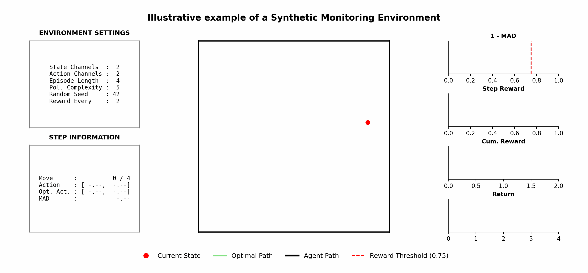

# SME-RL: Synthetic Monitoring Environments for Reinforcement Learning

[](https://badge.fury.io/py/sme-rl)
[](https://opensource.org/licenses/MIT)
[](https://arxiv.org/abs/2603.06252)

<div align="center">
  <!-- 🖼️ PLACEHOLDER FOR YOUR FIGURE -->
  
  <p><i>*Figure 1: Trajectory and Reward Dynamics in a 2D Synthetic Monitoring Environment (SME).* This animation contrasts an agent's trajectory (black traces) against the optimal policy (green trace) within a $2$-dimensional SME. *State Space (Center)*: The SME uses a triangle wave transition function to map linear action shifts into continuous, elastic wall reflections, guaranteeing a uniform state distribution. The red dot marks the current state, while fading traces show historical phase-space exploration. *Configuration & Actions (Left)*: Details the static environment parameters (top) and the exact multidimensional action vectors chosen at each step (bottom). *Metrics (Right)*: Performance is based on the Mean Absolute Difference (MAD) between the agent's and optimal actions. The agent earns a Step Reward only when 1 - MAD exceeds the red threshold line ($0.75$). Rewards gather internally as Cum. Reward and are distributed to the Return stack every reward_every steps.</i></p>
</div>

**SME-RL** provides highly configurable Synthetic Monitoring Environments for evaluating Deep Reinforcement Learning algorithms. Designed for rapid prototyping, sanity checking, and fundamental RL research, SME integrates natively with the [Gymnasium](https://gymnasium.farama.org/) API.

# Installation

You can install the package directly from PyPI:

```bash
pip install sme-rl
```
Note: SME-RL supports Python 3.8+ and relies on PyTorch and Gymnasium.

# Quick Start
SME-RL is registered as a standard Gymnasium environment. You can initialize it using gymnasium.make() and immediately use it with standard RL libraries like Stable-Baselines3.

```Python
from stable_baselines3 import PPO
from sme_rl.sme import SME

env = SME(
    n_state_channels=8,
    n_action_channels=4,
    episode_length=100,
    reward_every=1,
    min_reward=0.,
    kill_threshold=0.,
    policy_complexity=1,
)

model = PPO("MlpPolicy", env, verbose=0)
 
model.learn(total_timesteps=1_000_000, progress_bar=True)
```

#  Configuration Parameters
You can heavily customize the complexity and rules of the environment during instantiation:

| Parameter | Symbol | Type | Default | Description |
|---|---|---|---|---|
| `n_state_channels` | N_s | int | Required | Dimensionality of the state space. |
| `n_action_channels` | N_a | int | Required | Dimensionality of the action space. |
| `episode_length` | — | int | 100 | Maximum steps per episode before truncation. |
| `reward_every` | k | int | 1 | Step interval for reward distribution. |
| `min_reward` | r_min | float | 0.0 | Minimum threshold for a step reward to be registered. |
| `kill_threshold` | D | float | 0.0 | Reward threshold below which the episode terminates early (survival difficulty). |
| `policy_complexity` | C_pi* | int | 1 | Depth of the optimal policy network. |
| `seed` | — | int | 1 | Global seed for procedural generation and reproducibility. |

# Within- and Out-of-Distribution Evaluation

`SME-RL` features a built-in evaluation framework to benchmark your trained agent's generalization capabilities. By using the `.eval()` method, you can probe the policy across both within-distribution (WD) states (typically bounded between 0 and 1) and wide out-of-distribution (OOD) states.

The evaluation computes the mean absolute error between your agent's choices and the ground-truth optimal policy network, mapping performance to a normalized reward score.

### Usage Example

```python
# After training your model (e.g., using Stable-Baselines3)
states, opt_actions, model_actions, rewards = env.eval(
    model=model,
    storepath="results/eval_run",   # Saves data as an .npz archive
    channel_min=-1.0,               # Lower bound for OOD exploration
    channel_max=2.0,                # Upper bound for OOD exploration
    probes=10000,                   # Number of evaluation sample points
    wd_weight=0.5                   # 50% within-distribution, 50% out-of-distribution
)

print(f"Evaluated {len(states)} states.")
print(f"Mean evaluation score: {rewards.mean():.4f}")
````

### Evaluation Parameters

| Parameter | Type | Default | Description |
|---|---|---|---|
| `model` | `object` | Required | The trained RL agent (expects a `.predict()` interface compatible with SB3). |
| `storepath` | `str / Path` | `None` | Filepath directory where evaluation metrics are written out as a compressed `.npz` file. |
| `channel_min` | `float` | `0.0` | Minimum bounds for sampling evaluation state channels. Limits below 0 test OOD behavior. |
| `channel_max` | `float` | `1.0` | Maximum bounds for sampling evaluation state channels. Limits above 1 test OOD behavior. |
| `probes` | `int` | `10000` | The total number of evaluation samples generated. |
| `wd_weight` | `float` | `0.5` | Ratio of within-distribution samples (`[0, 1]`) relative to wide distribution samples. |

### Returned Outputs

The evaluation function returns a tuple of four arrays:

| Output | Description |
|---|---|
| `states` | The sampled synthetic verification states. |
| `opt_a` | Target action tensors generated by the ground-truth optimal policy structure. |
| `a` | Action predictions selected by your trained model. |
| `raw_reward` | Normalized scores scaled between `0.0` and `1.0` indicating how tightly your model mirrors optimal actions. |

evaluation metrics are written out as a compressed `.npz` file if the `storepath` parameter in the `eval()` method is specified.
## 📖 Citation
If you use this environment in your research, please cite our paper:

```Code-Snippet
@misc{pleiss2026smerl,
      title={Synthetic Monitoring Environments for Reinforcement Learning}, 
      author={Leonard Pleiss},
      year={2026},
      eprint={2603.06252},
      archivePrefix={arXiv},
      primaryClass={cs.LG}
}
````
##  License
This project is licensed under the MIT License.
